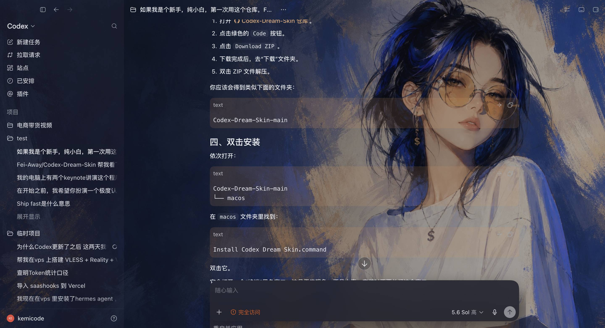

# CodexAura

给 Codex 桌面端换肤的 macOS 菜单栏小工具。**一个 App，双击即用** —— 不装 Node、不装 SwiftBar、不跑 shell 脚本。



*用户自选图片 + 自动提取配色：壁纸清晰、面板有边界、文字全适配*

## 为什么比 Codex-Dream-Skin 好用

| | Codex Dream Skin | CodexAura |
|---|---|---|
| 形态 | 一堆 `.command` / shell 脚本 + SwiftBar 插件 | 单个菜单栏 App |
| 依赖 | 借用 Codex 包内 Node 跑注入器 | 零依赖，纯 Swift 原生实现 CDP 协议 |
| 切主题 | 跑脚本 / 编辑 JSON | 菜单里点缩略图，**不重启 Codex** |
| 微调 | 改配置文件 | 暗角 / 模糊滑杆实时生效 |
| 自定义主题 | 手动裁图调色 | 选一张图，自动裁 16:9、自动提取配色 |
| 主题分享 | 无 | 一键导出 / 导入 zip 主题包 |
| 广告 | 主题内嵌赞助商标语注入 IDE | 无广告、无埋点、完全本地 |
| 兼容 | — | 可直接导入 Dream Skin 全部预设包 |

## 原理（与原作相同的安全边界）

1. 以 `--remote-debugging-address=127.0.0.1 --remote-debugging-port=9341` 重启 Codex（即 ChatGPT.app，bundle id `com.openai.codex`）
2. 通过 CDP 找到 `app://` 页面，用 DOM 探针（`main.main-surface` + `aside.app-shell-left-panel`）确认是 Codex 本体
3. 注入一段幂等 JS：用主题色全量覆写 Codex 自己的 CSS 设计变量（背景 / 文字 / 图标 / 边框）+ 全屏清晰壁纸层，面板保持高不透明度和可见边框，区域边界清晰
4. 菜单栏 App 常驻保活：页面刷新 / 新开窗口自动重新注入

- **不修改** `.app` / `app.asar` / 任何官方文件与签名
- CDP 只绑 `127.0.0.1`，注入前校验 Codex 签名（TeamID `2DC432GLL2`）
- 一键还原：移除全部注入内容，不留痕迹
- 任意图片自动裁 16:9、提取深色系配色（面板色 / 强调色 / 文字色），浅色深色外观下效果一致

## 安装

需要 macOS 14+（Apple Silicon / Intel 均可），源码构建：

```bash
git clone <你的仓库地址>
cd CodexAura
./Scripts/build-app.sh        # 产物在 build/CodexAura.app
open build/CodexAura.app
```

首次运行如被 Gatekeeper 拦截：**右键 App → 打开**。自己编译 + ad-hoc 签名，不需要 Apple 开发者账号，零费用。

## 使用

1. 点菜单栏的调色盘图标
2. Codex 已在运行但未开调试端口时，点一下「重启 Codex 以启用换肤」（只弹这一次）
3. 点主题缩略图即可换肤；拖动「暗角 / 模糊」滑杆实时微调
4. 「导入图片…」把任意图片变成主题（自动裁 2560×1440 + 提取配色）
5. 「导入 DS 预设」一键搬入本机已装的 Dream Skin 预设
6. 「还原官方外观」随时回到原生界面

> 换肤期间请让 CodexAura 常驻菜单栏（它是注入保活进程）；退出 App 后，当前主题保留到 Codex 下次刷新或重启。

内置预设包含「剪纸山海守夜人」「发财程序员」「星光小队长」「千禧信使」「元气食堂」。内置预设会随版本升级，不能删除；仍可导出分享，暗角和模糊微调也会在升级时保留。

## CLI（调试 / 自动化）

```bash
CodexAura --cli doctor                 # 检查 Codex 安装与签名
CodexAura --cli restart                # 重启 Codex 并开调试端口
CodexAura --cli apply --theme <id>     # 注入主题（--shot out.jpg 附带截图）
CodexAura --cli shot --out <路径>      # 截取 Codex 窗口
CodexAura --cli restore                # 还原官方外观
CodexAura --cli themes                 # 列出主题库
CodexAura --cli import-image --path <图> [--name <名>]
CodexAura --cli import-presets         # 导入 Dream Skin 预设
```

## 主题包格式

一个目录 = 一个主题：`theme.json` + `background.jpg` + `thumb.jpg`（缩略图）。

```json
{
  "schemaVersion": 1,
  "revision": 1,
  "id": "my-theme",
  "name": "我的主题",
  "image": "background.jpg",
  "appearance": "auto",
  "colors": { "background": "#101216", "panel": "#171a20", "accent": "#7aa2f7",
              "text": "#eceef2", "muted": "#a2a8b0", "line": "rgba(255,255,255,.14)",
              "onAccent": "#000000" },
  "dim": 0.35, "blur": 0, "focusX": 0.5, "focusY": 0.45
}
```

`appearance` 可设为 `auto`、`light` 或 `dark`；省略时自动根据背景色选择控件外观和遮罩方向。`onAccent` 省略时会在黑白之间自动选择对比度更高的按钮文字色。旧主题无需迁移，缺少这些字段时仍按兼容默认值读取。

兼容读取 Dream Skin 的 preset 包（缺 `colors` 时自动从图片提取）。内置预设的生图构图规范见 [docs/preset-image-prompts.md](docs/preset-image-prompts.md)。

## 测试

```bash
./Scripts/test.sh
```

单元测试覆盖旧主题兼容、明暗主题推导、强调色文字对比度、内置预设安装/升级/幂等、删除保护，以及全部内置图片的尺寸和体积约束。

## 已知边界

- Codex 没开调试端口时无法热注入（CDP 限制，所有同类工具都一样）→ App 里一键重启即可
- 调试端口无认证：换肤期间本机任何进程都能连接 127.0.0.1 上的 CDP 端口（所有同类工具相同的限制）。回环绑定只是防远程访问，不是认证——在本机运行不可信软件的环境中请谨慎使用
- Codex 大版本更新可能改 DOM 选择器 → 探针失败时 App 会明确提示，不会静默失效
- 概念效果图里那种完全自定义的界面布局（自绘卡片/徽章/插画按钮）超出换肤范畴 —— 真实上限是「清晰壁纸 + 主题色面板 + 原生控件」，与本仓库截图一致

## 声明

- 非 OpenAI 官方产品；Codex 及相关权利归其权利人
- 灵感来源：[Fei-Away/Codex-Dream-Skin](https://github.com/Fei-Away/Codex-Dream-Skin)（MIT）。本项目代码为独立实现
- MIT License
